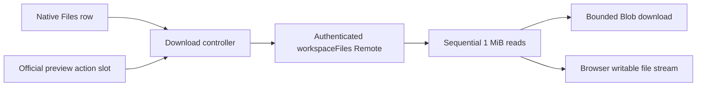

# Architecture

`dsh-file-download` is a client extension with a no-op server entry. Installation adds one Cordis row through `cordis.patch.yml`; `package.json` declares its bundle and browser dependencies. It registers no HTTP routes or model tools.

## Source boundaries

| File                | Responsibility                                                                                         |
| ------------------- | ------------------------------------------------------------------------------------------------------ |
| `src/download.mjs`  | Result validation, file identity checks, ranged copies, and a bounded writer.                          |
| `src/archive.mjs`   | Recursive enumeration, archive planning, source rechecks, and sequential ZIP copying.                  |
| `src/zip.mjs`       | ZIP32 records, UTF-8 path validation, CRC-32, and bounded archive budgets.                             |
| `src/client.mjs`    | Row adapter, preview component, transfer lifecycle, browser save APIs, and accessible status messages. |
| `src/index.mjs`     | No-op Cordis server entry.                                                                             |
| `scripts/build.mjs` | Deterministic esbuild output; React stays external and is supplied by Harness.                         |
| `scripts/pack.mjs`  | Validated runtime archive and SHA-256 checksum.                                                        |

## Transfer lifecycle

1. Resolve the original path and owning session. Previews can reference files from a different session; the resource address supplies that owner.
2. Stat the file, retaining its absolute path, version, and byte length.
3. Select a bounded in-memory writer or the browser's writable file stream.
4. Recheck identity and read sequential chunks. Validate each chunk's identity, offset, data type, size, and end marker before writing.
5. Stat again after the final chunk, then close the destination.
6. For small files, pass the completed Blob to the browser with the original basename.

Identity checks reject mixed versions, truncation, and invalid offsets. They depend on the host's version metadata and do not independently lock the source file. `AbortSignal` cancels reads; transfer failures abort the writer. Temporary object URLs are revoked after 60 seconds or on plugin unload.

## Folder transfer lifecycle

The folder control opens a save picker immediately when supported. It recursively calls the native `list` service, rejects truncated/unsafe listings, and stats regular files before allocating a writer. A bounded plan records relative ZIP paths, sizes, and file identities; its exact stored ZIP size selects or validates the fallback buffer.

Files stream through the same checked `copyFile` function into a shared ZIP destination. Each entry uses an incremental CRC-32, a local header, and a data descriptor. Central directory records remain bounded by the metadata budget. Every write is awaited, providing destination backpressure.

After copying, directory membership and all file identities are checked again. Only then are the central directory and end record written and the destination closed. Cancellation or any failure aborts the whole archive. `fflate` is used only as an independent test reader; no ZIP library is included at runtime.

## UI lifecycle

The row adapter observes added elements and relevant kind/path/session attribute changes. It adds sibling controls to regular-file and directory rows without replacing native handlers. Directory navigation is untouched. Official preview and Files-toolbar slots mount React components; unmounting cancels their transfers.

Unloading disconnects the observer, cancels active transfers, removes injected controls and styles, clears timers, and revokes temporary URLs. A shared controller limits concurrency to two transfers.

## Trust boundary

The file Remote is the same authenticated service used by Harness. This plugin adds no sandbox, permission escalation, new authentication mechanism, or path confinement. The underlying host can support file reads outside a workspace; folder listings remain workspace-scoped. Buttons act on native file/directory rows, the current Files root, or the original file represented by a native preview.

Files are treated as bytes. No content is evaluated or converted, and filenames are assigned through DOM properties rather than inserted as HTML. Status messages use text nodes. There is no analytics or external upload path.
